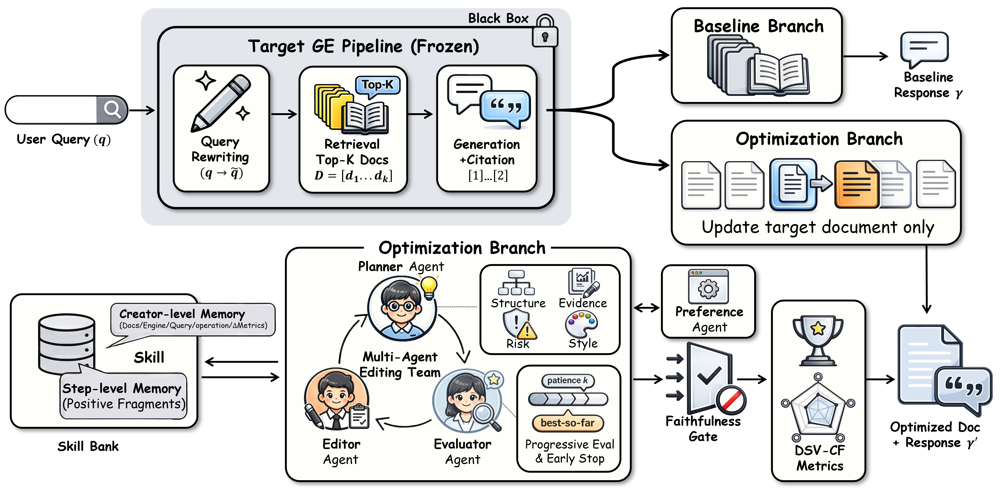
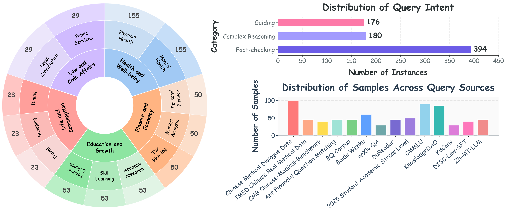
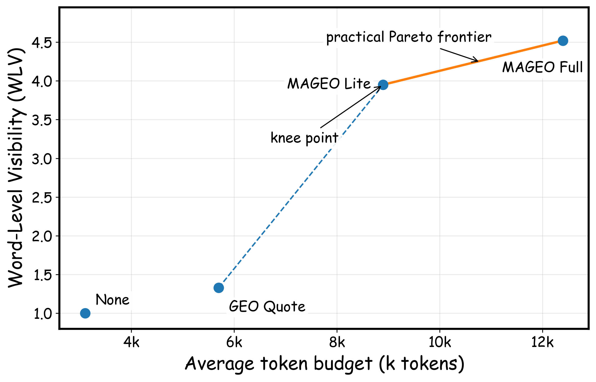

<p align="center">
  <h1 align="center">From Experience to Skill: Multi-Agent Generative Engine Optimization via Reusable Strategy Learning</h1>
  <h3 align="center">MAGEO</h3>
</p>

<p align="center">
  <em>
    A framework for optimizing document visibility and influence in generative engines
  </em>
</p>


<p align="center">
  
  
  
  
  
</p>

<p align="center">
  <a href="#overview">Overview</a> |
  <a href="#why-mageo">Why MAGEO</a> |
  <a href="#method">Method</a> |
  <a href="#code-map">Code Map</a> |
  <a href="#quick-start">Quick Start</a> |
  <a href="#results">Results</a>
</p>

---

## Overview

**MAGEO** is a **Generative Engine Optimization (GEO)** framework designed for the post-SEO setting, where content is no longer judged only by list ranking, but by how it is **selected, cited, exposed, and integrated** into final answers generated by large language model based engines.

Unlike conventional SEO pipelines, MAGEO treats optimization as a **closed-loop decision process** over document revision, engine preference modeling, answer-level evaluation, memory retrieval, and safety-aware candidate selection. This repository focuses on the **core optimization workflow**, rather than legacy demos or general-purpose agent infrastructure.

In our implementation, the main loop is centered on:

- **Preference Agent** for engine preference profiling
- **Planner Agent** for revision planning
- **Editor Agent** for candidate generation
- **Evaluator Agent** for DSV-CF scoring
- **Hierarchical Memory** for cross-step and cross-instance reuse
- **Fidelity Gate** for attribution and faithfulness preservation

The primary orchestration entry is [pipeline/geo_optimizer.py](pipeline/geo_optimizer.py).

---

## Why MAGEO

The paper starts from a simple observation: in generative engines, content creators no longer optimize only for retrieval rank. They optimize for whether their content ultimately **shapes the answer**.

This shift introduces four structural challenges:

- **Opaque presentation**: exposure is mediated by generated answers rather than a transparent ranked list.
- **Undefined objectives**: the optimization target is multi-dimensional, not a single ranking score.
- **Unclear optimization path**: document edits affect answer synthesis through a complex latent pipeline.
- **Ambiguous engine preference**: different engines may reward different forms of evidence, structure, and style.

MAGEO addresses these challenges with a memory-augmented multi-agent loop that optimizes not only for visibility, but also for **influence and reliability**.

---

## Why This Repository Is Different

This repository is intentionally scoped as a **research-grade implementation** rather than a broad agent platform.

- It keeps the method components that matter for the main optimization workflow.
- It removes historical modules that would blur the main contribution.
- It makes the evaluation objective explicit through the **DSV-CF** metric family.
- It keeps safety constraints first-class via a **fidelity-aware candidate gate**.

If you want to understand the actual system path from idea to code, this repository is meant to be that bridge.

---

## Method

### From SEO to GEO

<p align="center">
  
</p>
<p align="center">
  <b>Figure 1.</b> The shift from ranking-oriented SEO to answer-mediated GEO raises new questions about presentation opacity, measurement, optimization path, and cross-engine preference ambiguity.
</p>

### MAGEO Framework

<p align="center">
  
</p>
<p align="center">
  <b>Figure 2.</b> MAGEO combines preference modeling, planning, multi-candidate editing, answer-level evaluation, fidelity-aware selection, and hierarchical memory within a closed optimization loop.
</p>

### Core Pipeline

The current implementation follows this main loop:

1. Build an initial baseline under a **Twin-Branch evaluation protocol**.
2. Normalize engine-specific heuristics into a reusable **Preference Profile**.
3. Retrieve reusable patterns from **dual-layer memory**.
4. Ask the **Planner Agent** to generate a high-level revision strategy.
5. Ask the **Editor Agent** to produce multiple candidate revisions.
6. Ask the **Evaluator Agent** to score candidates with DSV-CF metrics.
7. Select only candidates that pass the **Fidelity Gate**.
8. Write back successful edits to **Step-level** and **Creator-level** memory.
9. Stop early when the **DSV-CF** objective reaches a plateau.

### Multi-Agent Roles

| Agent / Module | Responsibility | Main Entry |
|---|---|---|
| Preference Agent | Convert raw engine rules into a structured preference profile | [agent/preference_agent.py](agent/preference_agent.py) |
| Planner Agent | Generate revision plans conditioned on preference and memory | [agent/planner_agent.py](agent/planner_agent.py) |
| Editor Agent | Produce diverse candidate rewrites from the revision plan | [agent/editor_agent.py](agent/editor_agent.py) |
| Evaluator Agent | Predict candidate quality under the DSV-CF objective | [agent/evaluation_agent.py](agent/evaluation_agent.py) |
| GEO Optimizer | Coordinate the full closed-loop process | [pipeline/geo_optimizer.py](pipeline/geo_optimizer.py) |

### Hierarchical Memory

MAGEO uses a two-level memory design:

- **Step-level memory** stores local successful edit traces within an optimization trajectory.
- **Creator-level memory** stores reusable editing patterns across queries, documents, and engines.

Relevant files:

- [memory/memory_bank.py](memory/memory_bank.py)
- [memory/schema.py](memory/schema.py)

### DSV-CF Objective

The repository implements a two-axis evaluation family:

- **SSV**: `WLV`, `DPA`, `CP`, `SI`
- **ISI**: `AA`, `FA`, `KC`, `AD`

The unified objective is:

```text
S_DSV-CF = λ * SSV + (1 - λ) * ISI - γ * (10 - AA)
```

Default settings in code:

- `lambda = 0.5`
- `gamma = 0.5`

Implementation:

- [evaluation/metrics.py](evaluation/metrics.py)
- [evaluation/candidate_selector.py](evaluation/candidate_selector.py)

### Fidelity Gate and Early Stopping

Candidate selection is not purely reward-maximizing. MAGEO explicitly rejects candidates that degrade attribution or faithfulness beyond the configured tolerance.

In the current implementation:

- `AA` and `FA` are treated as safety-critical dimensions.
- Candidates must satisfy the fidelity threshold before they are eligible.
- Optimization halts early when the DSV-CF objective stops improving for `k` rounds.

This logic is implemented in [evaluation/candidate_selector.py](evaluation/candidate_selector.py).

---

## Code Map

The repository is organized so that the core method maps cleanly to the main components:

| Paper Concept | Repository Implementation |
|---|---|
| Twin-Branch Evaluation Protocol | [evaluation/simulated_evaluator.py](evaluation/simulated_evaluator.py) |
| Preference Profiling | [agent/preference_agent.py](agent/preference_agent.py) |
| Planning | [agent/planner_agent.py](agent/planner_agent.py) |
| Multi-Candidate Editing | [agent/editor_agent.py](agent/editor_agent.py) |
| DSV-CF Evaluation | [agent/evaluation_agent.py](agent/evaluation_agent.py), [evaluation/metrics.py](evaluation/metrics.py) |
| Fidelity-Aware Selection | [evaluation/candidate_selector.py](evaluation/candidate_selector.py) |
| Dual-Layer Memory | [memory/memory_bank.py](memory/memory_bank.py), [memory/schema.py](memory/schema.py) |
| Closed Optimization Loop | [pipeline/geo_optimizer.py](pipeline/geo_optimizer.py) |

Additional design notes:

- [docs/paper_alignment.md](docs/paper_alignment.md)
- [MAGEO_开发文档.md](MAGEO_开发文档.md)
- [docs/test_phase.md](docs/test_phase.md)

### Deliberately Removed Legacy Components

To keep the repository focused on the main method, earlier auxiliary modules have been removed from the main path, including:

- `FusionAgent`
- `ReactAgent`
- `ToolAgent`
- `SummaryMemory`
- generic tool registries and helper scaffolding
- DAG-style pipeline base classes unrelated to the final method
- earlier online demo scripts not aligned with the final paper loop

---

## Repository Structure

```text
MAGEO/
├── README.md
├── MAGEO_开发文档.md
├── docs/
│   ├── paper_alignment.md
│   └── test_phase.md
├── agent/
├── evaluation/
├── memory/
├── model/
├── pipeline/
├── prompt/
├── config/
├── scripts/
├── test/
└── tool/
```

High-level module responsibilities:

- `agent/`: core agent roles
- `evaluation/`: DSV-CF metrics, safety gate, candidate selection
- `memory/`: step-level and creator-level memory
- `pipeline/`: the optimization orchestration layer
- `tool/`: external search interface
- `scripts/`: interactive and batch experiment entrypoints
- `test/`: focused unit tests for the core pipeline

---

## Installation

### Requirements

- Python `3.12+`
- `uv` recommended, though `pip` also works

### Setup

```bash
git clone https://github.com/Wu-Beining/MAGEO.git
cd MAGEO

uv venv
source .venv/bin/activate

uv pip install -r requirements.txt
```

For Windows:

```powershell
.venv\Scripts\activate
```

### Configuration

This repository separates **environment variables** from **model configuration**:

1. Copy `.example_env` to `.env` if you want to use a custom config path.
2. Copy `config/config.yaml.example` to your actual config file.
3. Fill in your provider-specific model settings in that config.
4. Export `WEB_SEARCH_API_KEY` if you want to run the interactive search pipeline.

Example:

```bash
cp .example_env .env
cp config/config.yaml.example config/config.yaml
```

Notes:

- `tool/web_search.py` depends on the optional `zai-sdk`.
- The interactive entrypoint checks `WEB_SEARCH_API_KEY`.
- Core modules can still be imported even if the web-search dependency is absent.

---

## Quick Start

### Interactive Optimization

To optimize a single document-selection scenario end-to-end:

```bash
python -m pipeline.interactive_optimize --query "Best AI coding agents" --auto
```

Useful flags:

- `--query` / `-q`: target user query
- `--auto` / `-a`: automatically choose the first retrieved result
- `--yes` / `-y`: skip confirmation and continue until early stopping

This path runs:

- query rewriting
- web search
- document selection
- answer generation
- DSV-CF evaluation
- closed-loop revision and final answer regeneration

### Batch Optimization

For benchmark-style batch execution:

```bash
python scripts/batch_optimize_v2.py --json path/to/test_queries.json
```

Expected JSON format:

```json
[
  {
    "index": 1,
    "query": "Best AI coding agents",
    "is_optimized": false,
    "log": ""
  }
]
```

Alternative batch entrypoints:

- `python scripts/batch_optimize.py --json path/to/test_queries.json`
- `python scripts/batch_optimize_sequential.py --json path/to/test_queries.json`

### Logs and Outputs

By default, optimization artifacts are written under `log/`, including:

- optimization trajectories
- source metadata
- final answers
- web search traces
- memory snapshots

---

## Results

### Dataset Overview

<p align="center">
  
</p>
<p align="center">
  <b>Figure 3.</b> Distribution of query intent, topical coverage, and source composition for the benchmark setting used in our GEO analysis.
</p>

### Practical Pareto Frontier

<p align="center">
  
</p>
<p align="center">
  <b>Figure 4.</b> A practical Pareto frontier illustrating the trade-off between token budget and word-level visibility, with MAGEO targeting better visibility-efficiency balance.
</p>

### Qualitative Takeaway

Compared with aggressive heuristic GEO or naive single-model rewriting, MAGEO is designed to improve answer-level visibility and influence **without giving up attribution quality and faithfulness constraints**. The key intuition is not just "edit more," but "edit with structured preference, memory, and safety-aware evaluation."

---

## Reproducibility and Testing

The repository currently keeps a focused test surface around the core pipeline.

Run:

```bash
pytest -q
```

Focused files include:

- [test/test_candidate_selector_unit.py](test/test_candidate_selector_unit.py)
- [test/test_config_base_unit.py](test/test_config_base_unit.py)
- [test/test_memory_bank.py](test/test_memory_bank.py)
- [test/test_qa.py](test/test_qa.py)
- [test/test_query_rewrite.py](test/test_query_rewrite.py)

---

## Citation

If you find this repository useful in your research, please cite the corresponding paper once the bibliographic entry is finalized.

```bibtex
@misc{mageo2026,
  title        = {MAGEO: Memory-Augmented Multi-Agent Generative Engine Optimization},
  author       = {Add Your Author List Here},
  year         = {2026},
  note         = {ACL 2026}
}
```


---


